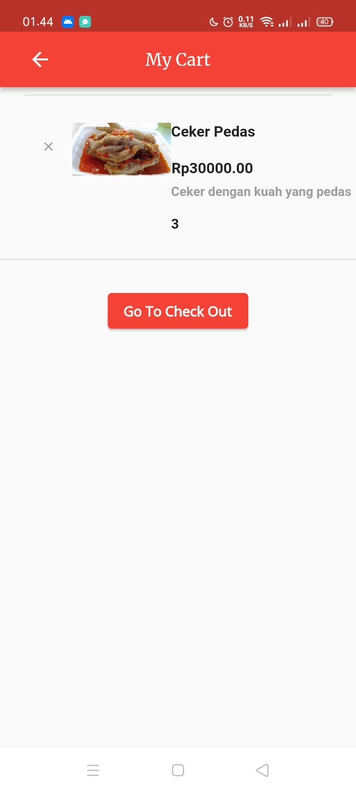
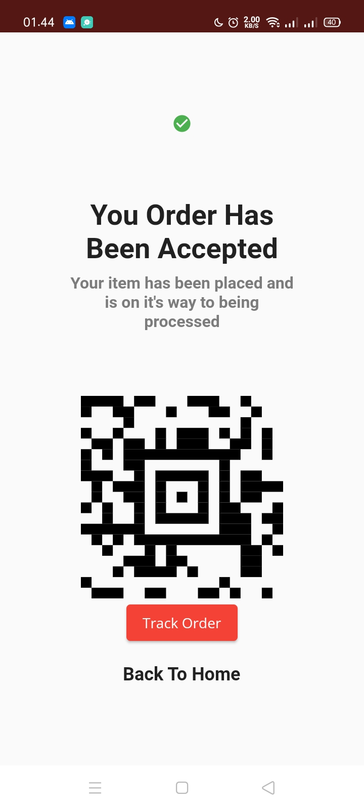
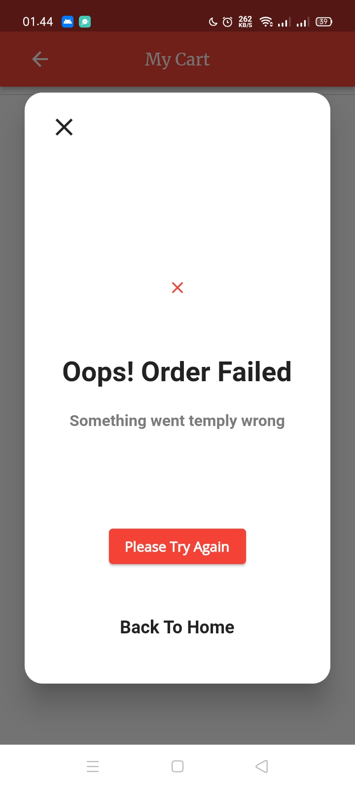
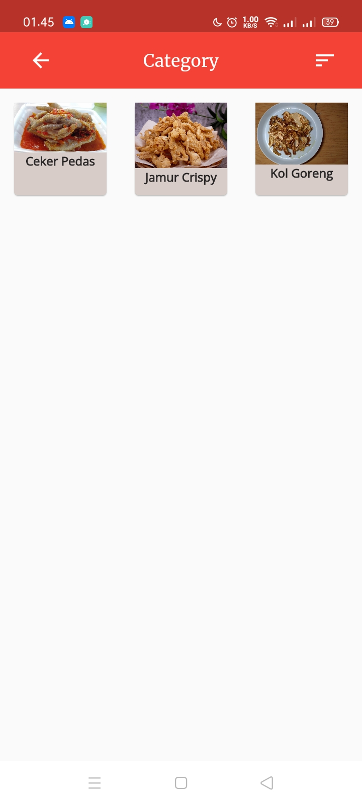
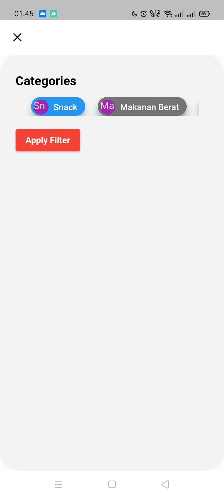
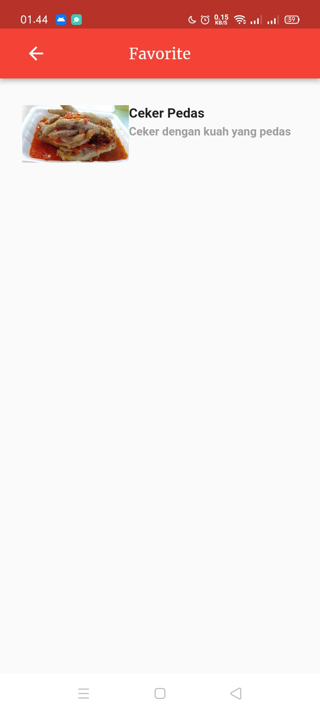

# Mini Project MSIB Flutter

Mini Project MSIB Alterra Academy Program Become a Flutter Master. From zero to hero

## Fitur

Berikut adalah fitur-fitur dari aplikasi Mayfoods, terdiri dari :

### Screen
- [Splash Screen](lib/screens/component/splash_screen.dart)
- [Welcome Screen](lib/screens/home_screen.dart)
- [Register](lib/screens/profile/register_screen.dart)
- [Login](lib/screens/profile/login_screen.dart)
- [Profile](lib/screens/profile/profile_screen.dart)
- [Daftar Menu](lib/screens/food/food_screen.dart)
- [Detail Menu](lib/screens/food/food_detail_screen.dart)
- [Favorite](lib/screens/component/favorite_screen.dart)
- [Category](lib/screens/category/category_screen.dart)
- [Keranjang](lib/screens/cart/cart_screen.dart)

### API
- [FoodAPI](lib/model/api/food_api.dart)
- [UserAPI](lib/model/api/user_api.dart)

### Model
- [Food Model](lib/model/food_model.dart)
- [User Model](lib/model/user_model.dart)

### ViewModel
- [Food View Model](lib/screens/food/food_view_model.dart)
- [User View Model](lib/screens/profile/user_view_model.dart)

## Screenshoot

  - Splash Screen

  

  - Welcome Screen

   

  - Login Screen

  

  - Register Screen

  

  - Draw Screen

   

  - Profile Screen
  
  

  - Food Screen (Daftar Menu)

  

  - Detail Screen

   

  - Cart Screen

  

  - Checkout Order Accept Screen

  

  - Checkout Order Failed Screen

  

  - Bottom Sheet

  

  - Category Screen

  
  
  - Filter Screen Category

  

  - Favorite Screen

  

